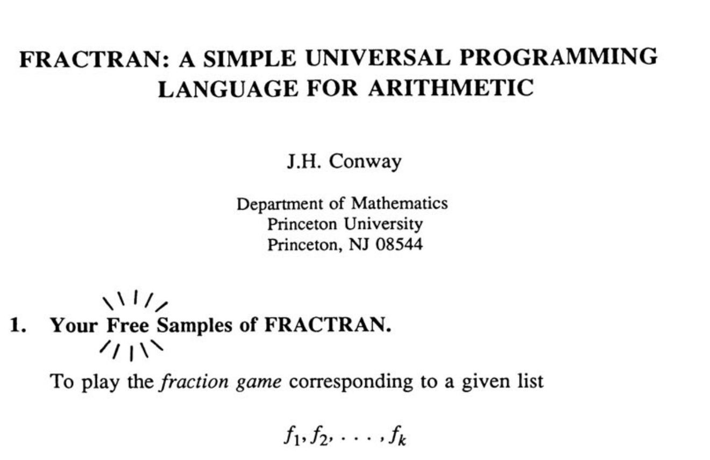

#  FRACTRAN: A Simple Universal Programming Language for Arithmetic 
### Unofficial [LeetArxiv](https://leetarxiv.substack.com/p/fractran-a-simple-universal-programming) implementation of the paper 'FRACTRAN: A Simple Universal Programming Language for Arithmetic' in C

The code walkthrough is available on [LeetArxiv at this link](https://leetarxiv.substack.com/p/fractran-a-simple-universal-programming).



### Paper Summary
FRACTRAN is an esolang built upon register machines, a theoretical alternative to turing machines for computation. In 1987, John Conway realized one can compute with prime numbers as registers alongside the laws of logarithms instead of read/write heads on a tape.

Fractran accumulates results in the exponent of the prime factors of an integer using the laws of logarithms,


### Getting Started

3. The C code implementation is in the file `ConwayInterpreter.c`. We walk you through the code here: [LeetArxiv](https://leetarxiv.substack.com/p/fractran-a-simple-universal-programming).

To run the file with
```
clear && gcc ConwayInterpreter.c -lm -o m.o && ./m.o
```
